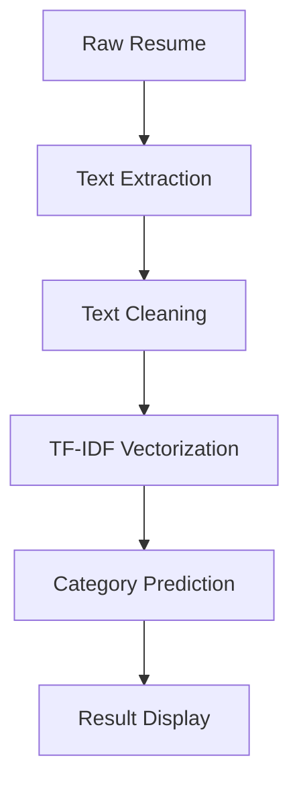

# Resume Classification System

 *(Add screenshot/GIF later)*

An automated resume classification system that predicts job categories using machine learning. Processes PDF/DOCX/TXT resumes and classifies them into 24 distinct job categories.

## 🛠️ Technical Stack
- **Frontend**: Flask, HTML/CSS, Bootstrap
- **Backend**: Python 3.9+
- **ML Framework**: Scikit-learn
- **NLP**: TF-IDF Vectorization
- **File Processing**: PyPDF2, python-docx

## 🔍 Machine Learning Process

### 1. Data Preparation
```python
import pandas as pd
from sklearn.preprocessing import LabelEncoder

# Load dataset
df = pd.read_csv('UpdatedResumeDataSet.csv') 

# Encode categories
le = LabelEncoder()
df['Category_Encoded'] = le.fit_transform(df['Category'])

# Sample data distribution
print(df['Category'].value_counts())
```

### 2. Text Preprocessing
```python
import re

def clean_resume(text):
    text = re.sub(r'http\S+\s', ' ', text)  # Remove URLs
    text = re.sub(r'@\S+', ' ', text)       # Remove mentions
    text = re.sub(r'[%s]' % re.escape("""!"#$%&'()*+,-./:;<=>?@[\]^_`{|}~"""), ' ', text)
    text = re.sub(r'\s+', ' ', text)        # Remove extra whitespace
    return text
    
df['Cleaned_Resume'] = df['Resume'].apply(clean_resume)
```

### 3. Feature Engineering
```python
from sklearn.feature_extraction.text import TfidfVectorizer

tfidf = TfidfVectorizer(
    sublinear_tf=True,
    stop_words='english',
    max_features=1500)

X = tfidf.fit_transform(df['Cleaned_Resume'])
y = df['Category_Encoded']
```

### 4. Model Training
```python
from sklearn.multiclass import OneVsRestClassifier
from sklearn.svm import LinearSVC
from sklearn.model_selection import train_test_split

X_train, X_test, y_train, y_test = train_test_split(X, y, test_size=0.2, random_state=42)

clf = OneVsRestClassifier(LinearSVC())
clf.fit(X_train, y_train)

# Save models
import pickle
pickle.dump(clf, open('models/clf.pkl', 'wb'))
pickle.dump(tfidf, open('models/tfidf.pkl', 'wb'))
pickle.dump(le, open('models/encoder.pkl', 'wb'))
```

### 5. Evaluation Metrics
```python
from sklearn.metrics import classification_report

y_pred = clf.predict(X_test)
print(classification_report(y_test, y_pred, target_names=le.classes_))
```
### Workflow Diagram

### File Structure
```tree
/resume-screener/
├── app.py              #Flask application
├── models/             #Trained ML models
│   ├── clf.pkl         #Classifier
│   ├── tfidf.pkl       #Vectorizer
│   └── encoder.pkl     #Label encoder
├── templates/          #HTML templates
├── requirements.txt    #Dependencies
└── UpdatedResumeDataSet.csv  #Training data
└── Resume Screening with Python.ipynb  #Jupyter Notebook with workflow and examples
```

### 💻 How to Run
```bash
pip install -r requirements.txt
python app.py
```

### User Interface after Running


### Select the Option to Upload File and see Extracted Text


### Example of Result showing Category


